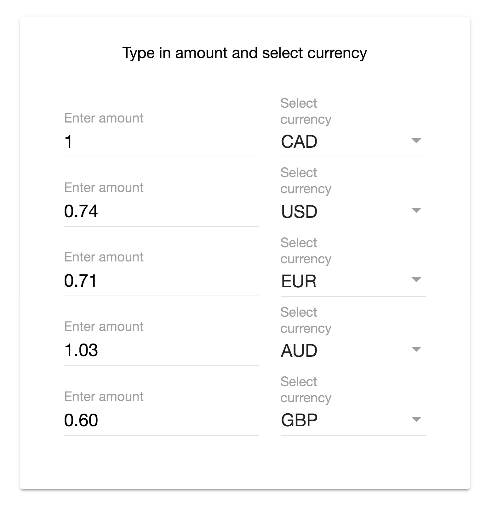

# Currency Converter

This Angular 2 based app allows you to convert currencies based on exchange rates provided by <a href="http://fixer.io/">fixer.io</a>.



## Prerequisites

Node.js and npm. <a href="https://docs.npmjs.com/getting-started/installing-node" target="_blank" title="Installing Node.js and updating npm">
Get it now</a> if it's not already installed on your machine.

## Install npm packages & Run App

Install the npm packages described in the `package.json` and verify that it works:

```bash
npm install
tsc
npm start
```

The `npm start` command first compiles the application,
then simultaneously re-compiles and runs the `lite-server`.
Both the compiler and the server watch for file changes.

Shut it down manually with `Ctrl-C`.
